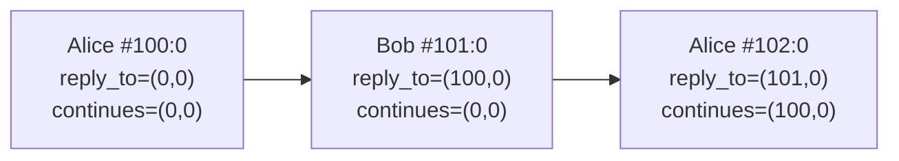

# SAMP: Substrate Account Messaging Protocol

Version 1.0, 2026-04-07

## Abstract

SAMP defines signed, optionally encrypted messages between accounts on Substrate blockchains. Messages are submitted as `system.remark_with_event` extrinsics. The extrinsic signature authenticates the sender. The account's sr25519 public key doubles as the ECDH encryption key, so encrypting to someone requires only their SS58 address.

SAMP does not duplicate data the extrinsic already carries. Sender identity, signature, timestamp, and replay protection come from the extrinsic and block context. The remark payload contains only the content type, routing fields, encryption material, and message body.

## Conventions

The key words "MUST", "MUST NOT", "REQUIRED", "SHALL", "SHOULD", "RECOMMENDED", "MAY", and "OPTIONAL" are interpreted as described in [RFC 2119](https://www.rfc-editor.org/rfc/rfc2119).

All multi-byte integers are little-endian. Hexadecimal values are prefixed with `0x`. The operator `||` denotes byte concatenation.

## 1. Protocol Byte

The first byte of every SAMP remark encodes the protocol version and content type: upper nibble = major version, lower nibble = content type. The upper nibble MUST be `0x1` for this specification (SAMP v1). The lower nibble determines the content type:

| Byte | Type | Encrypted |
|---|---|---|
| `0x10` | Public message | No |
| `0x11` | Encrypted message | Yes (1:1) |
| `0x12` | Thread message | Yes (1:1) |
| `0x13` | Channel creation | No |
| `0x14` | Channel message | No |
| `0x15` | Group message | Yes (multi-recipient) |
| `0x16` | Reserved for Forward Secret 1:1 Encryption (design pending) | -- |
| `0x17` | Reserved (SAMP spec, unallocated) | -- |
| `0x18`-`0x1F` | Application-defined | -- |

Lower-nibble values `0x0`-`0x7` are reserved for the SAMP specification. Values `0x8`-`0xF` are open for applications to define. An application MAY assign custom semantics to any byte in the `0x18`-`0x1F` range without coordinating with the SAMP specification. SAMP implementations that encounter an unrecognized type in either range MUST skip the remark.

A client MUST check `remark[0] & 0xF0 == 0x10` to identify SAMP v1 remarks. Non-matching remarks MUST be skipped.

### 1.1 Versioning

SAMP has two distinct version namespaces.

The **wire major version** is the upper nibble of `remark[0]` and is the only version field encoded on the wire. It changes only for wire-incompatible cryptographic or structural changes — for example, modifying the AEAD AAD shape, changing a primitive, or restructuring the byte layout. Future major bumps follow a dual-read pattern: a v2 client would read both `0x1*` and `0x2*` and write only `0x2*`, ensuring v1 messages remain readable forever.

The **SDK package version** follows SemVer (MAJOR.MINOR.PATCH) where MAJOR tracks the wire major version, MINOR bumps when a new content type is allocated within the same wire major (for example, adding `0x16` for Forward Secret 1:1 Encryption would bump the SDKs to 1.1.0), and PATCH bumps for bug fixes and ergonomic improvements that are wire-invisible. The wire format intentionally encodes only the wire major version; minor and patch evolution happens via lower-nibble content type allocations and SDK releases respectively.

This is the entire reason the protocol byte is split into an upper nibble (breaking) and a lower nibble (additive). The 4-bit upper nibble allows 15 future major versions; the 4-bit lower nibble allows 8 SAMP-spec content types and 8 application-defined content types per major.

## 2. Block Reference

A 6-byte reference to a specific extrinsic on a finalized block:

| Offset | Size | Field |
|---|---|---|
| 0 | 4 | `block_number` (u32 LE) |
| 4 | 2 | `extrinsic_index` (u16 LE) |

The zero reference `(0, 0)` indicates "none" for DAG references or "root" for thread/group identity.

## 3. Wire Formats

### 3.1 Public Message (`0x10`)

| Offset | Size | Field |
|---|---|---|
| 0 | 1 | `0x10` |
| 1 | 32 | `recipient` (AccountId) |
| 33 | var | `body` (UTF-8) |

The body MUST be valid UTF-8. Body length = remark length - 33.

### 3.2 Encrypted Message (`0x11`)

| Offset | Size | Field |
|---|---|---|
| 0 | 1 | `0x11` |
| 1 | 1 | `view_tag` |
| 2 | 12 | `nonce` |
| 14 | 32 | `ephemeral` (compressed Ristretto255) |
| 46 | 32 | `sealed_to` (XOR-masked recipient) |
| 78 | var | `ciphertext` (ChaCha20-Poly1305 output including 16-byte auth tag) |

The `view_tag` is a 1-byte recipient filter derived from the ECDH shared secret (Section 5.3). The `nonce` MUST be unique per sender. The `sealed_to` field enables sender self-decryption (Section 5.8) and is bound into the AEAD AAD (Section 5.6) so the wire-declared recipient is authenticated against the auth tag. Encryption overhead: 80 bytes (32 + 32 + 16).

### 3.3 Thread Message (`0x12`)

Same wire structure as `0x11`. After decryption, the plaintext has this structure:

| Offset | Size | Field |
|---|---|---|
| 0 | 6 | `thread_ref` (BlockRef) |
| 6 | 6 | `reply_to` (BlockRef) |
| 12 | 6 | `continues` (BlockRef) |
| 18 | var | `body` (UTF-8) |

`thread_ref = (0, 0)` means this is the root message; its on-chain position becomes the thread ID. Otherwise, `thread_ref` points to the root.

### 3.4 Channel Creation (`0x13`)

| Offset | Size | Field |
|---|---|---|
| 0 | 1 | `0x13` |
| 1 | 1 | `name_len` (u8) |
| 2 | var | `name` (UTF-8) |
| 2+NL | 1 | `desc_len` (u8) |
| 3+NL | var | `description` (UTF-8) |

`name` MUST be 1 to 32 bytes. `description` MUST be 0 to 128 bytes. Both MUST be valid UTF-8. Implementations MUST reject channel creation remarks that exceed these limits.

The on-chain position `(block, index)` of this remark becomes the permanent channel ID. The creator is the extrinsic signer.

### 3.5 Channel Message (`0x14`)

| Offset | Size | Field |
|---|---|---|
| 0 | 1 | `0x14` |
| 1 | 6 | `channel_ref` (BlockRef) |
| 7 | 6 | `reply_to` (BlockRef) |
| 13 | 6 | `continues` (BlockRef) |
| 19 | var | `body` (UTF-8) |

The body MUST be valid UTF-8. Not encrypted.

### 3.6 Group Message (`0x15`)

| Offset | Size | Field |
|---|---|---|
| 0 | 1 | `0x15` |
| 1 | 12 | `nonce` |
| 13 | 32 | `eph_pubkey` (compressed Ristretto255) |
| 45 | var | `capsules` (N * 33 bytes) |
| 45+33*N | var | `ciphertext` (ChaCha20-Poly1305 output including 16-byte auth tag) |

Each capsule (33 bytes) targets one group member:

| Offset | Size | Field |
|---|---|---|
| 0 | 1 | `view_tag` |
| 1 | 32 | `wrapped_key` (content key XOR key-encryption-key) |

The `eph_pubkey` is a shared ephemeral public key, the same for all capsules in the message. The sender derives it deterministically (Section 5.4). Each member's capsule wraps the same per-message content key K using a member-specific key-encryption-key derived from ECDH (Section 5.7). The sender MUST include themselves as one of the N members.

There is no `member_count` in cleartext. Recipients determine the capsule/ciphertext boundary using the stored member count from a previously decrypted group message, or by trial AEAD decryption at successive 33-byte boundaries (Section 6.1).

After decryption with K, the plaintext has this structure:

| Offset | Size | Field |
|---|---|---|
| 0 | 6 | `group_ref` (BlockRef) |
| 6 | 6 | `reply_to` (BlockRef) |
| 12 | 6 | `continues` (BlockRef) |
| 18 | var | `body` |

**Root message (group creation):** `group_ref = (0, 0)` means this is the root message; its on-chain position becomes the permanent group ID. The `body` of a root message begins with the member list:

```
member_count(1) || member_pubkeys (32 * N) || first_message (UTF-8, may be empty)
```

The `member_count` and member public keys are inside the ciphertext, not visible to observers. Members learn the full member list by decrypting the root message. The bytes after the member public keys are the first conversational message (UTF-8, can be zero-length). Groups have no name or description -- they are identified by their members, like threads.

**Regular message:** `group_ref != (0, 0)` points to the root. The `body` is UTF-8 text. A member who encounters a regular message before the root can decrypt it, read the `group_ref`, and fetch the root via DAG walking.

No identifiers are in cleartext. The `group_ref`, `reply_to`, `continues`, `body`, and member list are all encrypted. The sender is authenticated by the extrinsic signature. An observer cannot distinguish root messages from regular messages.

## 4. DAG Threading

Thread messages (`0x12`), channel messages (`0x14`), and group messages (`0x15`) carry block references that form a directed acyclic graph. Two references per message:

- `reply_to`: most recent message from any participant that the sender observed.
- `continues`: the sender's own previous message in this conversation.

Both use the BlockRef encoding (Section 2). `(0, 0)` means no prior context.



A client can walk the DAG backwards from any recent message to discover the full conversation without reading every block.

### Thread Identity

Thread messages carry a `thread_ref` in the encrypted plaintext:

- `thread_ref = (0, 0)`: this is the root. Its on-chain position becomes the thread ID.
- `thread_ref = (B, I)`: this message belongs to the thread rooted at `(B, I)`.

Messages with different `thread_ref` values are in different threads, even between the same participants.

### Group Identity

Group messages carry a `group_ref` in the encrypted plaintext:

- `group_ref = (0, 0)`: this is the root (group creation). Its on-chain position becomes the group ID.
- `group_ref = (B, I)`: this message belongs to the group rooted at `(B, I)`.

The group identity model is identical to the thread identity model.

## 5. Encryption

SAMP uses the account's sr25519 key for ECDH key agreement. Authentication is the extrinsic signature. Two encryption modes share the same underlying primitives: 1:1 encryption (one recipient, used by `0x11`/`0x12`) and multi-recipient encryption (N recipients, used by `0x15`).

### 5.1 Primitives

| Primitive | Specification |
|---|---|
| Key agreement | Ristretto255 ECDH |
| KDF | HKDF-SHA256 ([RFC 5869](https://www.rfc-editor.org/rfc/rfc5869)) |
| AEAD | ChaCha20-Poly1305 ([RFC 8439](https://www.rfc-editor.org/rfc/rfc8439)) |
| Signing scalar | sr25519 (Schnorrkel) Ed25519-mode expansion |

### 5.2 ECDH Shared Secret

Given a scalar `s` and a compressed Ristretto255 point `P`:

```
shared = compress(s * decompress(P))
```

The result is a 32-byte compressed Ristretto255 point used as input key material.

### 5.3 View Tag

A 1-byte filter that lets recipients cheaply reject messages not addressed to them:

```
tag = HKDF(salt=None, ikm=shared_secret, info="samp-view-tag", len=1)[0]
```

The `shared_secret` is the ECDH result between the recipient's scalar and the sender's ephemeral public key. False positive rate: 1/256.

### 5.4 Deterministic Ephemeral

The sender derives ephemeral keys deterministically from their seed, enabling self-decryption without storing per-message state.

**1:1 mode** (used by `0x11`/`0x12`): per-recipient ephemeral.

```
eph_bytes = HKDF(salt=None, ikm=sender_seed, info=recipient_pubkey || nonce, len=32)
eph_scalar = Scalar::from_bytes_mod_order(eph_bytes)
eph_pubkey = eph_scalar * G
```

**Multi-recipient mode** (used by `0x15`): shared ephemeral across all recipients.

```
eph_bytes = HKDF(salt=None, ikm=sender_seed, info="samp-group-eph" || nonce, len=32)
eph_scalar = Scalar::from_bytes_mod_order(eph_bytes)
eph_pubkey = eph_scalar * G
```

### 5.5 Content Encryption

All SAMP content encryption uses ChaCha20-Poly1305 AEAD:

```
ciphertext || auth_tag = ChaCha20-Poly1305(key, nonce, aad, plaintext)
```

The key is 32 bytes. The nonce is 12 bytes. The auth tag is 16 bytes appended to the ciphertext. The `aad` (additional authenticated data) is per-context (Sections 5.6, 5.7).

### 5.6 1:1 Encryption (`0x11`/`0x12`)

Given plaintext `P`, recipient public key `R`, nonce `N`, sender seed `S`:

1. Derive ephemeral per Section 5.4 (1:1 mode): `eph_scalar`, `eph_pubkey`
2. `shared = ECDH(eph_scalar, R)` (Section 5.2)
3. `seal_key = HKDF(salt=N, ikm=S, info="samp-seal", len=32)`
4. `sealed_to = R XOR seal_key`
5. `sym_key = HKDF(salt=N, ikm=shared, info="samp-message", len=32)`
6. `ciphertext || auth_tag = ChaCha20-Poly1305(sym_key, N, aad=sealed_to, P)` (Section 5.5)
7. Output: `eph_pubkey(32) || sealed_to(32) || ciphertext || auth_tag(16)`

Binding `sealed_to` into the AEAD AAD authenticates the wire-declared recipient against the auth tag: a sender cannot publish bytes whose ciphertext+tag is valid under one `sealed_to` and replace `sealed_to` with another value without breaking authentication.

**Recipient decryption:**

1. `shared = ECDH(signing_scalar, eph_pubkey)`
2. `sym_key = HKDF(salt=N, ikm=shared, info="samp-message", len=32)`
3. Decrypt `ciphertext` with `sym_key`, `N`, and `aad = content[32..64]` (the wire `sealed_to` bytes).

### 5.7 Multi-Recipient Encryption (`0x15`)

Given plaintext `P`, member public keys `[R_1, ..., R_N]`, nonce `N`, sender seed `S`:

1. Derive shared ephemeral per Section 5.4 (multi-recipient mode): `eph_scalar`, `eph_pubkey`
2. Generate random per-message content key `K` (32 bytes, cryptographically secure)
3. `ciphertext || auth_tag = ChaCha20-Poly1305(K, N, aad=None, P)` (Section 5.5)
4. For each member `i`:
   a. `shared_i = ECDH(eph_scalar, R_i)` (Section 5.2)
   b. `view_tag_i = HKDF(salt=None, ikm=shared_i, info="samp-view-tag", len=1)[0]` (Section 5.3)
   c. `kek_i = HKDF(salt=N, ikm=shared_i, info="samp-key-wrap", len=32)`
   d. `wrapped_key_i = K XOR kek_i`
5. Capsule for member `i`: `view_tag_i(1) || wrapped_key_i(32)` (33 bytes)

**Recipient scanning and decryption:**

1. `shared = ECDH(signing_scalar, eph_pubkey)` (one ECDH operation)
2. `my_tag = HKDF(salt=None, ikm=shared, info="samp-view-tag", len=1)[0]`
3. Scan capsule `view_tag` bytes. If no match, skip. (False positive rate per capsule: 1/256)
4. `kek = HKDF(salt=N, ikm=shared, info="samp-key-wrap", len=32)`
5. `K = wrapped_key XOR kek`
6. Decrypt `ciphertext` with `K` and `N`.

### 5.8 Sender Self-Decryption

**1:1 mode:** The sender recovers the recipient from `sealed_to`, re-derives the ephemeral, and computes the shared secret:

1. `seal_key = HKDF(salt=N, ikm=S, info="samp-seal", len=32)`
2. `R = sealed_to XOR seal_key`
3. Derive ephemeral from `S`, `R`, `N` (Section 5.4, 1:1 mode)
4. `shared = ECDH(eph_scalar, R)`
5. Decrypt as Section 5.6 (`aad = sealed_to`).

**Multi-recipient mode:** The sender re-derives the shared ephemeral from their seed and nonce (Section 5.4, multi-recipient mode), then scans capsules for their own `view_tag` like any other recipient. The sender MUST include themselves as one of the N members.

## 6. Processing Rules

### 6.1 Reading

For each `system.remark_with_event` extrinsic in a block:

1. Extract remark bytes.
2. If `remark[0] & 0xF0 != 0x10`, skip.
3. Parse by content type (`remark[0] & 0x0F`).
4. Sender = extrinsic signer. Timestamp = block timestamp.
5. For encrypted 1:1 types (`0x11`/`0x12`): compute view tag (Section 5.3). If mismatch and sender is not self, skip. Otherwise decrypt (Section 5.6) with `aad = content[32..64]`.
6. For group messages (`0x15`): compute `shared = ECDH(signing_scalar, eph_pubkey)`. Derive `my_tag`. Scan capsule view tags. If no match and sender is not self, skip. Otherwise unwrap content key, decrypt (Section 5.7). If `group_ref = (0, 0)`, parse body as group metadata (root message). Otherwise, parse body as UTF-8 text.

**Capsule/ciphertext boundary:** If the recipient has previously decrypted a message from this group, they know the member count N and can parse directly. Otherwise, after unwrapping the content key from a matching capsule at index `j`, the recipient tries AEAD decryption at boundaries `(j+1)*33`, `(j+2)*33`, etc. until authentication succeeds.

### 6.2 Sending

1. Encode remark bytes per Section 3.
2. Submit as `system.remark_with_event`, signed by the sender's account.
3. The extrinsic signature authenticates the message.

### 6.3 Nonce Uniqueness

The 12-byte nonce in encrypted messages MUST be unique per sender. Reuse breaks ChaCha20-Poly1305 confidentiality. Implementations SHOULD use a cryptographically secure random source.

## 7. Security

| Property | Guarantee |
|---|---|
| Sender authenticity | Substrate extrinsic signature (sr25519) |
| Message integrity | AEAD auth tag (encrypted) or extrinsic signature (public) |
| Wire-declared recipient binding (1:1) | AEAD AAD = `sealed_to`; declared recipient is authenticated against the tag |
| Recipient privacy (1:1) | 1-byte view tag; observer cannot determine recipient |
| Recipient privacy (group) | N view tags (opaque); observer cannot determine members or group size |
| Content confidentiality | ChaCha20-Poly1305 (encrypted types only) |
| Sender privacy | None; extrinsic signer is on-chain |
| Forward secrecy | None; compromised seed decrypts all past messages |

The ephemeral scalar for 1:1 messages is deterministic: `HKDF(seed, recipient || nonce)`. The ephemeral scalar for group messages is deterministic: `HKDF(seed, "samp-group-eph" || nonce)`. This enables sender self-decryption but means the seed decrypts all messages the account sent.

All messages are permanently on-chain. Encrypted messages cannot be deleted. A compromised seed exposes all past messages to or from that account.

SAMP uses Ristretto255 for all asymmetric operations. This does not provide post-quantum security. Encrypted messages on-chain are vulnerable to harvest-now-decrypt-later attacks by a future quantum adversary. This exposure is inherited from Substrate's sr25519 signature scheme.

### 7.1 Known Trade-offs

- **Key reuse for signing and ECDH.** SAMP uses the same expanded sr25519 scalar for both extrinsic signing and Ristretto255 ECDH key agreement. No public attack against this reuse exists, but it is a non-standard cryptographic property: a future cross-protocol attack against sr25519 would compromise SAMP's encryption confidentiality, not just signature forgery. SAMP makes this trade-off so that the recipient's encryption identity is equal to their SS58 address — encrypting to someone requires zero coordination beyond knowing their account.
- **View-tag oracle.** The 1-byte view tag leaks 8 bits per message about the candidate recipient set. An observer running every account's scalar against every view tag learns nothing more than they would by trial-decrypting -- but a targeted observer with a known scalar can quickly partition messages. Recipient unlinkability across messages is limited.
- **Nonce reuse is catastrophic.** AEAD nonce reuse breaks ChaCha20-Poly1305 confidentiality. Senders MUST use a cryptographically secure RNG for the 12-byte nonce.

## 8. Constants

| Name | Value | Purpose |
|---|---|---|
| `SAMP_VERSION` | `0x10` | Protocol version nibble |
| `CAPSULE_SIZE` | 33 | Bytes per capsule in group messages |
| `MESSAGE_KEY_INFO` | `"samp-message"` | Symmetric key derivation (1:1) |
| `VIEW_TAG_INFO` | `"samp-view-tag"` | View tag derivation |
| `SEAL_INFO` | `"samp-seal"` | Sealed recipient key derivation |
| `GROUP_EPH_INFO` | `"samp-group-eph"` | Group ephemeral derivation |
| `KEY_WRAP_INFO` | `"samp-key-wrap"` | Key wrapping in capsules |
| `CHANNEL_NAME_MAX` | 32 | Maximum channel/group name (bytes) |
| `CHANNEL_DESC_MAX` | 128 | Maximum channel/group description (bytes) |

## Appendix A: Minimum Remark Sizes

| Type | Fixed overhead | Minimum total |
|---|---|---|
| Public (`0x10`) | 33 bytes | 33 bytes |
| Encrypted (`0x11`) | 94 bytes | 94 bytes |
| Thread (`0x12`) | 94 + 18 plaintext header | 112 bytes |
| Channel creation (`0x13`) | 3 bytes | 3 bytes |
| Channel (`0x14`) | 19 bytes | 19 bytes |
| Group (`0x15`), 3 members | 45 + 99 + 18 header + 16 tag | 178 bytes |
| Group (`0x15`), 5 members | 45 + 165 + 18 header + 16 tag | 244 bytes |
| Group (`0x15`), 10 members | 45 + 330 + 18 header + 16 tag | 409 bytes |

1:1 encryption overhead: 80 bytes (ephemeral 32 + sealed_to 32 + auth_tag 16).
Group encryption overhead per member: 33 bytes (view_tag 1 + wrapped_key 32) + shared ephemeral (32 bytes, once) + auth_tag (16 bytes, once).

## Appendix B: Reference Implementations

| Language | Path | Version |
|---|---|---|
| Rust | `rust/` (samp-core on crates.io) | 1.1.0 |
| Python | `python/samp/` (samp-core on PyPI) | 1.1.1 |
| Go | `go/` | 1.1.0 |
| TypeScript | `typescript/` (samp-core on npm) | 1.1.0 |

## Changelog

**Version 1.0, 2026-04-07** -- Initial public release. Defines the upper-nibble version field, content types `0x10`-`0x15`, 1:1 and multi-recipient encryption (Ristretto255 ECDH + HKDF-SHA256 + ChaCha20-Poly1305 with `sealed_to` bound into the AEAD AAD for `0x11`/`0x12`), DAG threading via `reply_to`/`continues` block references, and channel/group identity rooted at on-chain extrinsic position.
